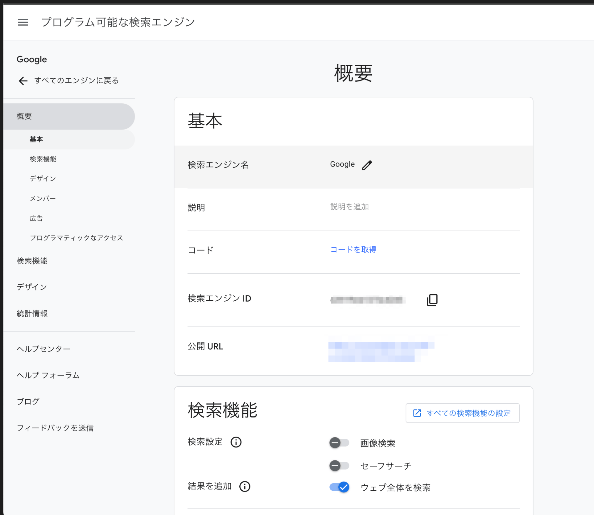
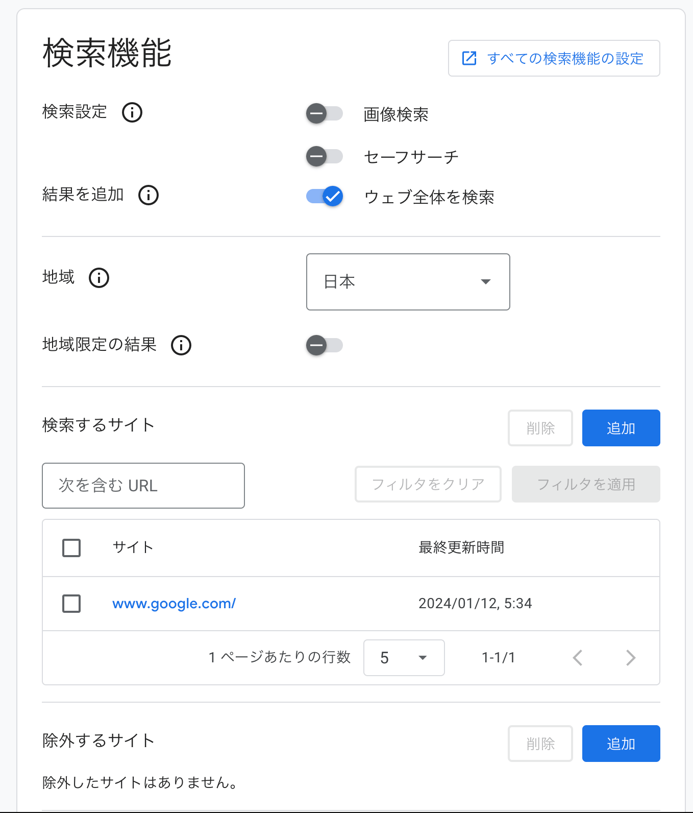

# Google Search API 概要

このドキュメントでは、Google Search API の導入方法について説明します。

Google Search API は、Google 検索エンジンの機能を利用するための API です。この API を使用することで、検索結果の取得や検索クエリの実行などを行うことができます。

## 導入手順

以下の手順に従って、Google Search API を導入してください。

1. Google Cloud Platform にアクセスし、プロジェクトを作成します。
2. プロジェクトのダッシュボードから、Google Search API を有効化します。
3. API キーを生成し、プロジェクトに紐付けます。
4. API キーを使用して、Google Search API を呼び出すコードを実装します。

以上が Google Search API の導入手順です。詳細な手順やサンプルコードについては、公式ドキュメントを参照してください。

### API 設定

<https://programmablesearchengine.google.com/controlpanel/all>





### Code

```json
<https://www.googleapis.com/customsearch/v1?key={APIキー}&cx={検索エンジンID}&q={任意の検索クエリ}>
```
